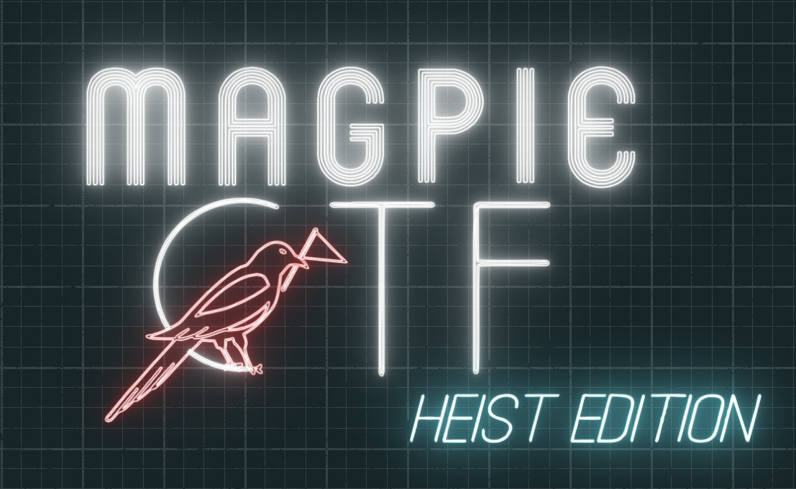

# magpieCTF 2022

## Overview
This repository contains challenges and other resources for magpieCTF 2022.

Courtesy of the University of Calgary Information Security Club ([https://infosecucalgary.ca/](https://infosecucalgary.ca/)).

**NOTE: The Magpienet challenge was too unstable during the competition and was removed from the competition after a few hours, but the code is still in this repo.**
